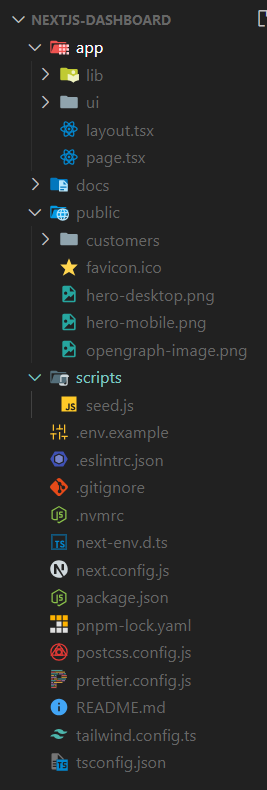

## 폴더 구조

- `/app`: 애플리케이션에 대한 모든 경로, 구성 요소 및 논리 등을 저장하는 곳 (주로 여기서 작업함)
  - `/lib`: 재사용 가능한 유틸리티 함수, 데이터 가져오기 함수 등 애플리케이션에서 사용되는 함수를 저장하는 곳
  - `/ui`: 카드, 테이블, 양식 등 애플리케이션의 모든 UI 구성요소를 저장하는 곳
- `/public`: 이미지와 같은 애플리케이션의 모든 정적 자산을 저장하는 곳
- `/scripts`: 데이터베이스를 채우는 데 사용할 시드 스크립트를 저장하는 곳
