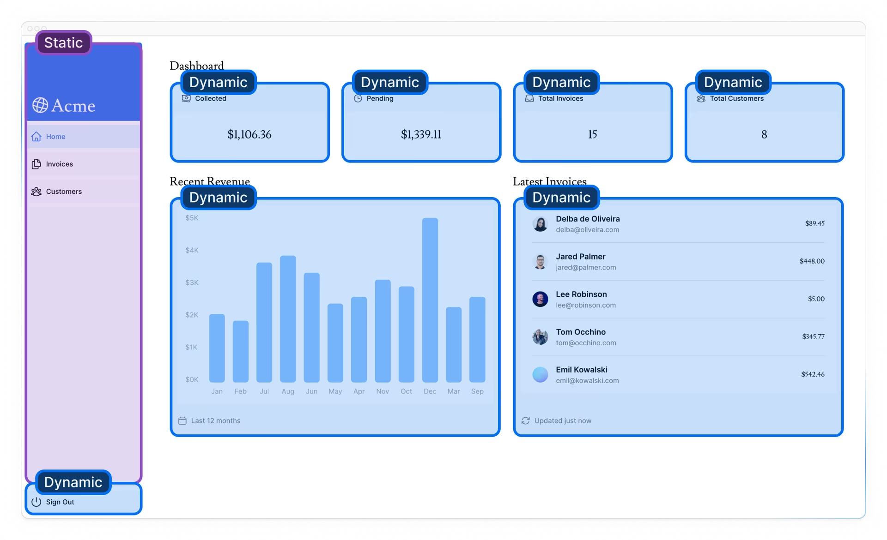

## 부분적 사전 렌더링, PPR (Partial Prerendering)

- Next.js에서 route에서 동적 함수(e.g. noStore(), cookie() 등)를 호출하면 전체 경로가 동적이 됨.
- 대부분 경로는 완전 정적이거나 동적이지 않은데, Next.js에서는 동일한 경로에서 정적 렌더링과 동적 렌더링의 이점을 결합할 수 있는 새로운 렌더링 모델인 "부분 사전 렌더링"의 실험적 버전을 도입했음.
  - 제품 정보 페이지 (정적) / 사용자 장바구니 및 추천 제품 (동적)
- 부분 사전 렌더링은 React의 Suspense를 사용하여 일부 조건이 충족될 때까지 애플리케이션의 렌더링 부분을 연기함.
  - Suspense의 fallback 정적 콘텐츠와 함께 초기 HTML 파일에 포함.(빌드할 때 정적 콘텐츠 사전 렌더링 -> CDN 또는 Edge Network에 캐시)
  - 사용자가 경로를 요청할 때까지 동적 콘텐츠 렌더링이 연기됨.
  - Suspense가 정적 코드와 동적 코드 사이의 경계로 사용됨. (Suspense에서 구성 요소를 래핑하면 구성 요소 자체가 동적으로 만들어지지 않는다)
- 아래와 같이 추가하면 특정 경로에 대해 PPR을 사용할 수 있음.

```js
// next.config.js
/** @type {import('next').NextConfig} */

const nextConfig = {
  experimental: {
    ppr: 'incremental',
  },
};

module.exports = nextConfig;
```

```ts
// 필요한 곳에서
export const experimental_ppr = true;
```

    
    
