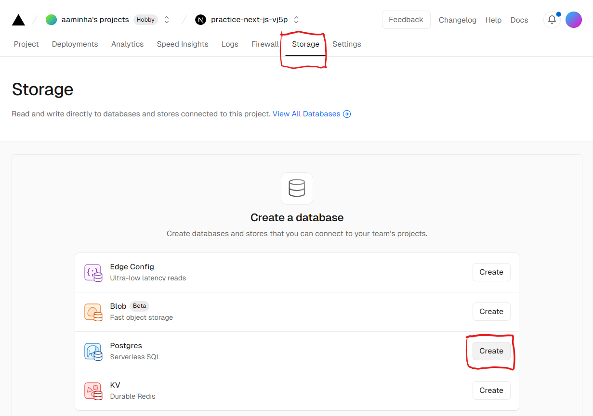

## vercel의 Postgres 데이터베이스

- 데이터베이스를 가까운 곳으로 설정하면 데이터 요청에 대한 대기 시간을 줄일 수 있음
- 단, 데이터베이스 생성하기 전에 지역을 정해야 함. 중간에 변경 불가능.

### 사용 방법

1. vercel에서 원하는 레퍼지토리를 배포한다.
2. Storage 탭에서 Postgres를 선택하여 데이터베이스를 생성한다.
   
3. 생성된 데이터베이스에서 .env.local 탭에 있는 시크릿 값들을 .env에 저장한다.
4. 터미널에서 `pnpm i @vercel/postgres`를 실행하여 Vercel Postgres SDK를 설치한다.
