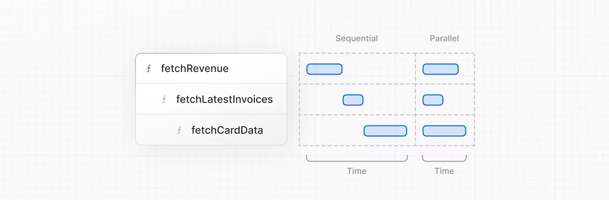

## waterfalls

- 이전 요청의 완료에 따라 달라지는 일련의 네트워크 요청을 나타냄.
- data fetching의 경우, 각 요청은 이전 요청이 데이터를 반환한 후에 시작할 수 있음.
- 꼭 나쁘다는 건 아님. 다음 요청을 하기 전에 조건이 충족되를 원할 땐 이 방식을 사용할 수 있음.
- 추가) 기본적으로 Next.js는 성능 향상을 위해 경로를 미리 렌더링(정적 렌더링)을 하는데, 이로 인해 데이터가 변경되면 대시보드에 반영되지 않는다.
  

## Parallel data fetching

- waterfalls를 방지하는 방법은 모든 데이터 요청을 동시에 병렬로 시작하는 것.
- `Promise.all()` 또는 `Promise.allSettled()`로 동시에 시작 가능.
